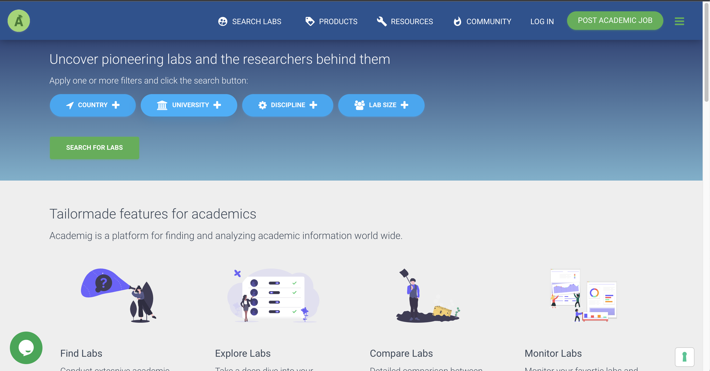

# Academig with Server-side Rendering (SSR)

## Development server

Run `ng serve` for a dev server. Navigate to `http://localhost:4200/`. The app will automatically reload if you change any of the source files.

## Production build

Run `npm build:client-and-server-bundles` to build the project for production environment. The build artifacts will be stored in the `dist/` directory.

## Running end-to-end tests

Run `ng e2e` to execute the end-to-end tests via [Protractor](http://www.protractortest.org/).
